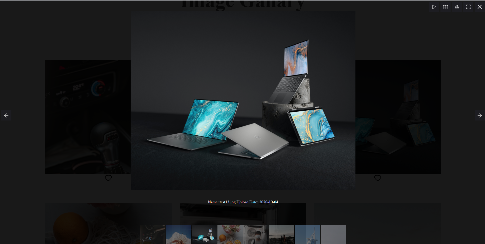

# Image Gallary

An web application that displays images made with React.js,Node.js,Express and MongoDB. Images are uploaded and stored to Google Clound Storage.

## Requirements

You must have Node.js installed on your device if you want to run the application locally

## Running Locally

1. In root directory run the command
    

   `npm install && client-install`
    
   to install all the dependency needed for the application.

2. In root directory run
    
   `node server.js`

3. In a seperate terminal navagate to the client directory of the application and run
    
   `npm start`
    

   this should automatically open up a web broswer with the application running locally.
   In the case where web browser does not open, open an web browser and go to "http://localhost:3000/"

**Note**: This git repository does not contain MongoDB and Google Cloud Platform Credentials.
You would have to provide your own credentials if you would like to run this application locally.
You would need a .env file containing

1. ATLAS_URL={your_connection_string}
2. GC_BUCKETNAME={your_google_cloud_bucket_name}

You would also need to provide your own Google Cloud Service account credentials

## Live Demo

Alternatively, You can find a live demo version of the application [here](https://ricky-image-gallary.herokuapp.com/)

